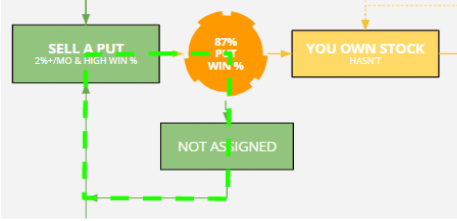
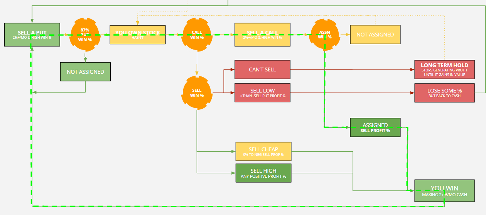
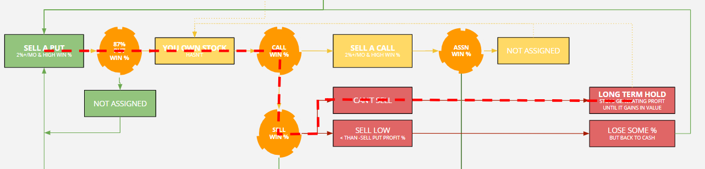
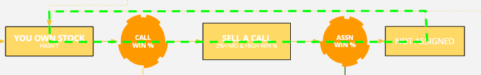
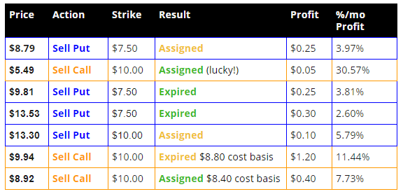
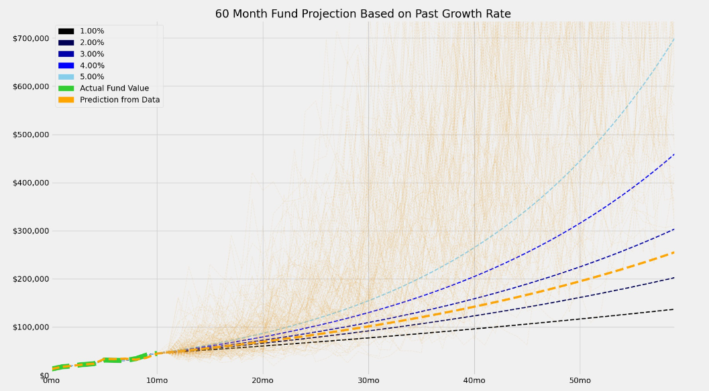
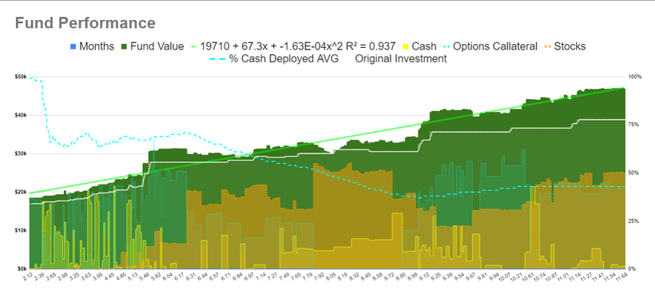

# Modeling The Wheel as a Markov Decision Process

If the stock market is a casino, people who sell premium are the house while people who buy premium are the gamblers. The goal of the wheel is to make small, reliable, consistent profits all the time and win through the power of the law of large numbers.

But first, a quick note on who this series is for: my posts are not meant for people who are starting with zero knowledge about options trading. If you don't know what puts, calls, delta, and theta are I recommend searching around for the thousands of decent introductions to the topic. **These posts are meant for someone who already knows what a CSP and CC is.This is not investment advice, tickers mentioned are mentioned purely as examples.**

With our disclaimers out of the way, let's dive in!

### **The Wheel, in a nutshell**

1.  Select ticker candidates that I would like to hold long term
2.  Sell CSPs (cash-secured puts)
3.  If I get assigned, sell CCs (covered calls)
4.  Once I am back to cash, I rinse and repeat

It is pretty simple, but it's simplicity can hide the complexity underneath. In the best case, the ticker is neutral to bullish with decent volatility. In that case, I can get assigned on my CSPs at low strikes, then assigned on my CCs on high strikes, and make premium on both. This is often called the triple profit strategy for that reason. In the worst case my puts get assigned, the stock tanks, and I can't sell CCs without risking locking in big losses. That's why I pick tickers that I am willing to hold, since good stocks will eventually rise back into the range where I can sell decent CCs.

The Wheel is a conservative strategy since I will make less during bull runs but earn more during neutral markets and lose less in bear markets. Although it has sometimes been compared to picking up pennies in front of a steamroller, it can produce good, regular, risk-adjusted returns if I don't make too many mistakes.

**Why is theta so important?**

When selling options, theta is the money I am making simply from time passing. An option buyer has to be right about both the direction and the timing, while the option seller has time on their side. Traders who earn money from high-theta options selling are members of theta gang.

**Why wheel instead of buy and hold?**

Slow and steady wins the race. Wheeling may not have the same gains as buying and holding SPY in bull markets, but it will outperform buy and hold in sideways and bear markets. It makes sense to wheel instead of buying and holding when I want to benefit from the upside of the market going up, but protect myself from some of the downside of the market crashing.

### My Model of The Wheel

The above model shows all the possible outcomes from a simple wheel as a [Markov Decision Process](https://en.wikipedia.org/wiki/Markov_decision_process). Each of the boxes is a possible state of the strategy for a single bet. The orange circles are a point where a random event happens with some probability. For example, when I sell a CSP, I've had an 85%-90% chance that I was not assigned. In reality, many of these nodes are rarely reached. The most common loop is quite simple, likely, and efficient:

The next most common loop is selling a put, having it be assigned, then I sell a call, and that is assigned:

If the stock is volatile but neutral, I can sell CSPs on low strikes and sell covered calls on high strikes, and make both premiums plus the difference between the strikes. On riskier stocks, I may want to sell the CSP and once I am assigned, I sell a covered call on the same strike that I bought it for.

What I am trying to avoid is a terminal state that stops my cash from earning reliable profit:

In the worst case the stock goes to 0 and I lose my entire investment, all 100 shares. Fortunately, this is quite rare. It may be recommended to sell low to free the capital in certain instances. Consult the (future) post on risk of ruin for more details on how often you should do this. Right now I only cut losses on trades at 70% loss of the original investment. As long as I don't reach 70% loss often, this really reduces my risk of a large drawdown of the entire portfolio. [More on that here.](https://www.patreon.com/posts/47698559)

Sometimes I can sell several calls in a row off of the stock I've been assigned. This can generally be pretty profitable if the stock stays neutral for a bit:

Each time I go through this loop, I can lower my cost-basis on the stock further, making the terminal route less and less likely. For example, I recently did a complete wheel on 1 contract of ATLC (1-3 weeks DTE for each trade) that went like this:

The entire set of trades took place over 5 months. As you can see from the table above, it is often possible to aggressively lower the cost basis on strikes at or above the current price. If I was not eventually assigned at $10.00 and was forced to move down to the $7.50 strike (the next lowest for this stock) I could get $1 - $1.50 premiums to continue lowering the cost basis. It is only when the stock makes quick dives that I can't recover, even while the price remains lower than what I bought it for the entire time. Since I have an expectation it will eventually go up (it is a long term hold, remember?) things usually will get better for me if the stock has dropped and it is difficult to sell calls at a high enough strike.

### The parameters (measured values) of the model

By plugging in the actual measured values of the model parameters (orange circles in the drawing) then running a bunch of simulations we can estimate the range of future returns. The parameters are:

1.  **sellPutWinPercentage**: the probability that I will not be assigned the stock when I sell a put for 2%/mo profit or more
    1.  **Currently ~86%** (195 trades)
    2.  Roughly equivalent to put delta, with some caveats
2.  **sellCallWinPercentage**: the probability that I can sell a call at or above my cost-basis for a stock Icurrently own
    1.  **Currently ~ 86%** (82 trades)
    2.  Sometimes, there are no good call options to sell. Sometimes, this can last years.
3.  **sellCallAssignedWinPercentage** : the probability that the call will be assigned.
    1.  **Currently ~ 20%** (16 trades)
    2.  Roughly equivalent to call delta, with some caveats
4.  **profitPerMonth**: expected value (EV) % profit normalized to the month. For example, if I sell a CSP on a $10 strike for $1 premium that lasts 2 months, I sold a 5%/mo CSP. If I cannot sell a call on an owned stock, the % profit/mo for that period is 0%. This is always 2%/mo or more for CSPs and CCs when I make the trade. No matter the outcome of the option I always make this profit on this parameter, as losses from stock depreciation are handled separately. It can go higher if I can buy-to-close the position for a higher % profit/mo
    1.  **Currently ~6.75%/mo** (277 trades)
5.  **profitOnAssign**: % profit when I sold call is assigned and I sell the stock I was holding. Could be negative. This is where my big losses will come from, but it is also potentially a source of much bigger wins
    1.  **Currently ~1.41%** (16 Trades)

The projections below sample from historical results for these values when simulating trading through the MDP model. Over time, as more trading is done, the projections should get more accurate and the range of projected possibilities should narrow somewhat. This strategy has tail risk, so we'd expect to be doing better than average at first and eventually lose some of my gains in single big losers. That should show up as all the orange lines moving out and down over time until it reaches the mean.

The single dotted orange line represents a simple monthly projection of past monthly earnings, while the orange cloud is made up of 150 model simulations that sample from the current, actual measured values of the parameters above. The model-based projections currently average to about ~6.75%/mo. The discrepancy is primarily due to capital deployment over time. Manually operating the strategy, I achieve only about 60% average capital deployment across CSPs and CCs over time. Here you can see a typical 8 months of trading that includes a $250mo regular addition to the portfolio (white line):

The difference between the white line and the dark green line at the top is the profit earned. The dotted blue line is a running average of capital available for CSPs. The orange line is value of all stocks owned. The yellow is value of all CSP collateral.

Now that we've introduced the model and covered the basics, we can move on to the details of how to actually execute the strategy. In later posts I'll cover how I pick tickers, my rules for selling CSPs/CCs, how I think about and manage risk, how I track my trades, and how changing the various parameters of the model impacts returns.
